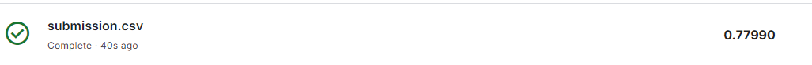

# Titanic-Project
## Confusion matrix and accuracy score for test set of train.csv
[[95 11]  
 [27 46]]  
0.7877094972067039

## Confusion matrix and accuracy score for test.csv
[[256  10]  
 [ 10 142]]  
0.9521531100478469

## Cross validation score
Accuracy: 83.30 %  
Standard Deviation: 3.63 %  

